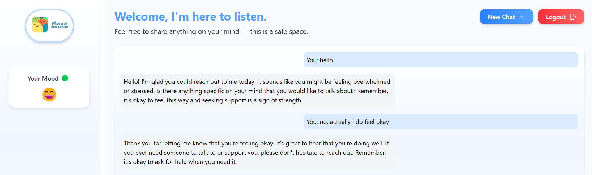

# Agent-m7ar7er

Agent-m7ar7er is an AI-powered assistant designed to support mental health and emotional well-being by offering personalized recommendations based on the user's current mood. Built during a 3-day hackathon, it uses a RAG (Retrieval-Augmented Generation) system to provide accurate and empathetic responses.

<br><br>

<br><br>

## 🧠 Features

- 🟢 Mood detection from user input  
- 🧩 Personalized suggestions based on emotions  
- 💡 RAG-based recommendation engine  
- 🎨 Clean and interactive frontend  
- 🔗 Smooth frontend-backend integration

## 🚀 Tech Stack

- **Frontend**: Next js, TypeScript
- **Backend**: Fast api 
- **AI Tools**: Ollama, Gemma 3B, LangChain, RAG, HuggingFace 

## 📦 Installation

### 1. Clone the repository

```bash
git clone https://github.com/lourimi-ayoub/Agent-m7ar7er.git
cd Agent-m7ar7er
```

### 2. Backend setup
```bash
cd mood-componion_rag
pip install -r requirements.txt
uvicorn main:app --reload
```

### 3. Frontend setup
```bash
cd ../frontend
npm install
npm run dev
```
